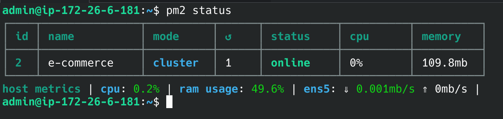
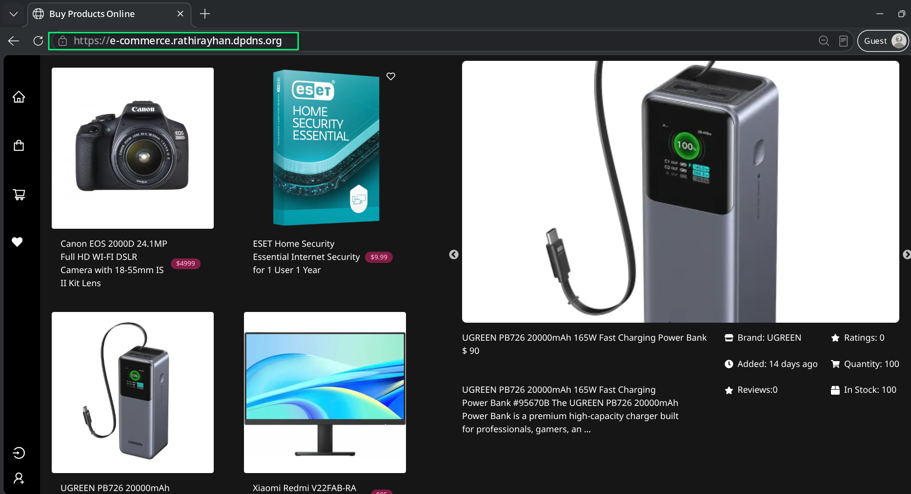

# Runbook: MERN E-Commerce Deployment on AWS Lightsail

This document outlines the standard operating procedure (SOP) for deploying a full-stack MERN (MongoDB, Express, React, Node.js) E-Commerce application on an AWS Lightsail Ubuntu instance. It includes backend process management, frontend static serving, reverse proxy configuration, and SSL implementation.

## Prerequisites
- AWS Lightsail VPS (Ubuntu)
- Node.js & npm installed
- PM2 installed globally (`npm install -g pm2`)
- Nginx & Certbot installed
- Domain configured in Cloudflare (DNS pointing to VPS IP)
- MongoDB installed locally (or MongoDB Atlas connection string)

---

## Step 1: Repository Setup & Permissions

Clone the repository into the standard web directory and set baseline permissions.

```bash
sudo git clone https://github.com/HuXn-WebDev/MERN-E-Commerce-Store /var/www/MERN-E-Commerce-Store
cd /var/www/MERN-E-Commerce-Store

# Assign ownership to the system admin user (assuming 'admin' for AWS Lightsail Debian/Ubuntu environments)
sudo chown -R admin:admin /var/www/MERN-E-Commerce-Store/backend
sudo chmod -R 755 /var/www/MERN-E-Commerce-Store/backend
```

---

## Step 2: Backend Deployment (Node.js & PM2)

Install dependencies, configure environment variables, and daemonize the backend process using PM2.

```bash
cd /var/www/MERN-E-Commerce-Store/backend
npm install

# Configure environment variables (Database URI, Ports, Secrets)
nano .env
```

Initialize and configure PM2 using an ecosystem file for better process control:
```bash
pm2 init simple
nano ecosystem.config.js
```

**`ecosystem.config.js` configuration:**
```javascript
module.exports = {
  apps : [{
    name: 'e-commerce-backend',
    script: 'index.js',
    watch: false,
    instances: 1, // Set to 'max' for multi-core scaling in clustered environments
    max_memory_restart: '500M', // Auto-restart to prevent memory leak crashes
    env: {
      NODE_ENV: 'production'
    }
  }],
};
```

Start the service and freeze the PM2 list for auto-startup on server reboot:
```bash
pm2 start ecosystem.config.js
pm2 save
pm2 startup
```
*Note: Verify the backend is running without errors using `pm2 logs e-commerce-backend`.*



---

## Step 3: Frontend Build

Generate the optimized static build for the React application.

```bash
cd /var/www/MERN-E-Commerce-Store/frontend
npm install
npm run build
```
*This generates a `dist` folder containing the production-ready static assets.*

---

## Step 4: Nginx Reverse Proxy & Static File Configuration

Configure Nginx to serve the static frontend, proxy API requests to the Node.js backend, and serve dynamic upload files securely.

```bash
sudo nano /etc/nginx/sites-available/e-commerce
```

**Nginx Configuration:**
```nginx
server {
    listen 80;
    listen [::]:80;
    server_name e-commerce.rathirayhan.dpdns.org;

    access_log /var/log/nginx/e-commerce_access.log;
    error_log /var/log/nginx/e-commerce_error.log;

    # 1. Serve Frontend React Static Files
    location / {
        root /var/www/MERN-E-Commerce-Store/frontend/dist;
        index index.html;
        try_files $uri $uri/ /index.html; # Fallback for React Router SPA
    }

    # 2. Proxy Backend Node.js API
    location /api/ {
        proxy_pass http://127.0.0.1:5000;
        proxy_http_version 1.1;
        proxy_set_header Host $host;
        proxy_set_header X-Real-IP $remote_addr;
        proxy_set_header X-Forwarded-For $proxy_add_x_forwarded_for;
        proxy_set_header X-Forwarded-Proto $scheme;
    }

    # 3. Serve Dynamic Uploads (Product Images)
    location /uploads/ {
        alias /var/www/MERN-E-Commerce-Store/backend/uploads/;
        autoindex off;
    }
}
```

Set appropriate ownership for Nginx to read the frontend and uploads:
```bash
sudo chown -R www-data:www-data /var/www/MERN-E-Commerce-Store/frontend/dist/
sudo chmod -R 755 /var/www/MERN-E-Commerce-Store/frontend/dist/
```

Enable the site and restart Nginx:
```bash
sudo ln -s /etc/nginx/sites-available/e-commerce /etc/nginx/sites-enabled/
sudo nginx -t
sudo systemctl restart nginx
```

---

## Step 5: SSL Integration (Certbot & Cloudflare)

Provision a Let's Encrypt SSL certificate. 

**Critical Edge-Case Note (Cloudflare):**
If the domain is managed via Cloudflare and DNS Proxy (Orange Cloud) is enabled, the Let's Encrypt HTTP-01 challenge will fail. 
1. Temporarily turn OFF the proxy (Grey Cloud) in Cloudflare DNS settings.
2. Run the Certbot command:
   ```bash
   sudo certbot --nginx -d e-commerce.rathirayhan.dpdns.org
   ```
3. Once the certificate is successfully issued, turn the Cloudflare proxy back ON (Orange Cloud) and ensure SSL/TLS encryption mode is set to "Full (strict)".


---

## Step 6: Post-Deployment Troubleshooting & Fixes

During the initial deployment, several edge cases were identified and resolved:

### 1. Missing Uploads Directory (Broken Images)
**Symptom:** Image uploads failed, and Nginx `e-commerce_error.log` reported `No such file or directory` for `/uploads/`.
**Root Cause:** The `uploads` directory is often ignored in `.gitignore` and is missing upon initial git clone.
**Fix:** Created the directory manually and ensured Nginx had the correct alias mapping.
```bash
mkdir -p /var/www/MERN-E-Commerce-Store/backend/uploads/
sudo chown -R www-data:www-data /var/www/MERN-E-Commerce-Store/backend/uploads/
```

### 2. Admin Access Lockout (Database Override)
**Symptom:** Unable to add products post-deployment as the application requires an Admin user, but no default seeder script was available.
**Fix:** 
1. Registered a standard user via the frontend UI.
2. Connected to MongoDB (via `mongosh` or MongoDB Compass).
3. Located the `users` collection and manually updated the newly registered user's document, setting `"isAdmin": true`.
4. Performed a hard refresh, logged out, and logged back in to gain access to the Admin Dashboard.
